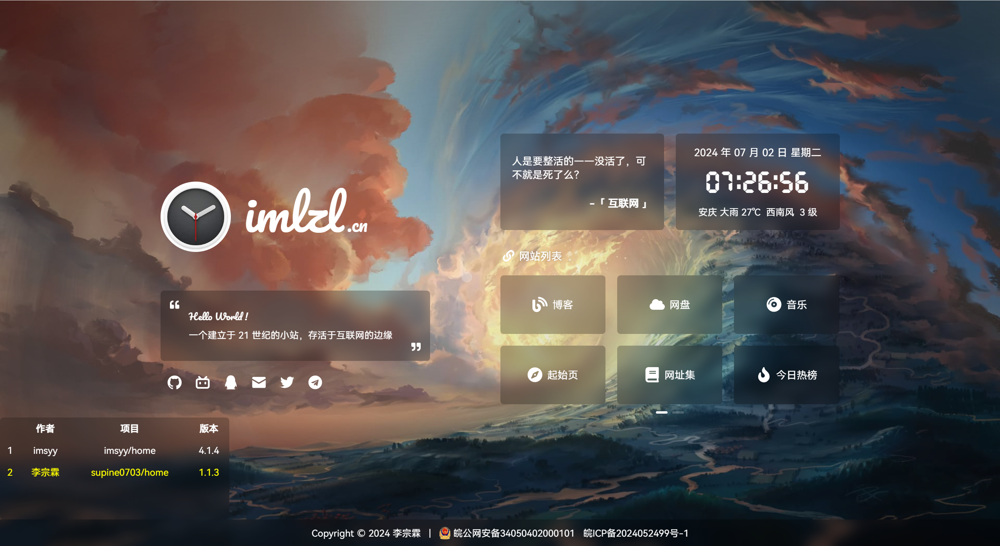
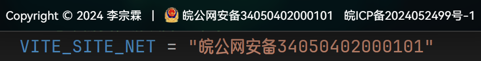
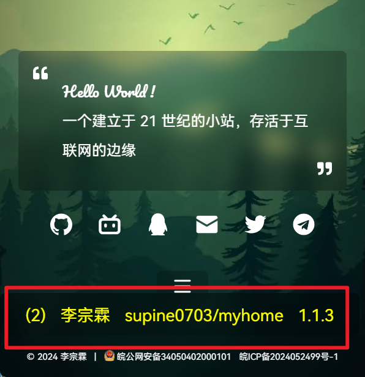
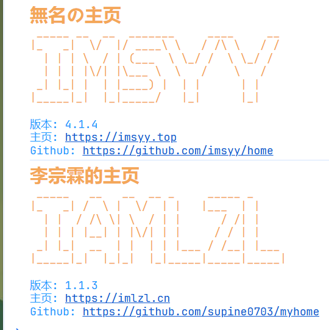
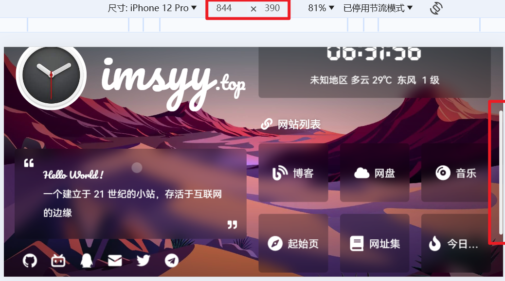
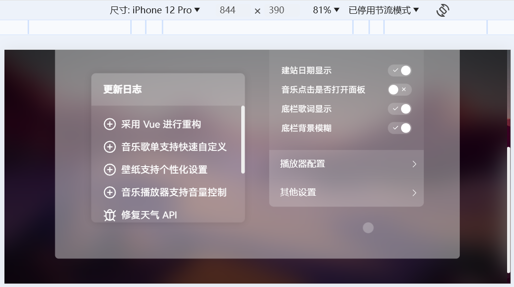
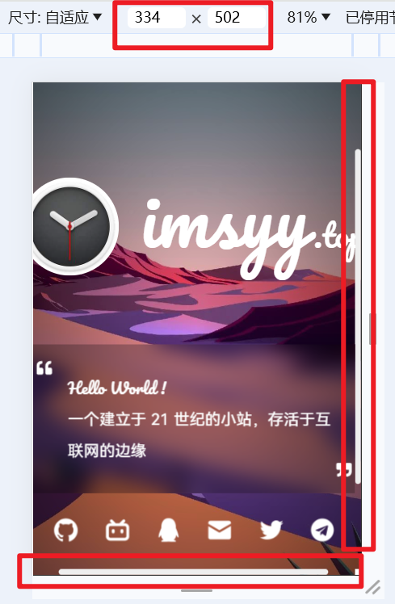

<p><strong><h2>个人主页</h2></strong></p>

> 基于 [imsyy/home v4.1.4](https://github.com/imsyy/home) 进行开发的个人主页。感谢`imsyy`大佬！  
> `imsyy/home`在移动端上适配不那么理想，我进行了优化并且添加了一些功能。  
> 我的 [fork](https://github.com/supine0703/imsyy-home) 更接近`imsyy`大佬的原生版本，也可以去我 [Pull request](https://github.com/imsyy/home/pull/315) 的看看。



## 👀 跳转
- 我的个人主页：[李宗霖的个人主页](https://imlzl.cn)
- imsyy的个人主页：[無名の主页](https://imsyy.top)
- 项目部署和基本功能：[imsyy 项目的 README.md](./docs/imsyy-home/README.md)
- 我的贡献：[#315](https://github.com/imsyy/home/pull/315)
- 项目前身：[imsyy/home v4.1.4](https://github.com/imsyy/home)


## 🎉 我的更改  
> 更新顺序为从下往上
- 1
- [添加公安备案](#添加公安备案)
- [独立出`Made By`视图](#独立出made-by视图)
- [解决小屏移动端显示问题](#解决小屏移动端显示问题)
- [优化 Copyright](#优化-copyright)
- [添加链接悬停效果](#添加链接悬停效果)
- [其他问题](#其他问题)

### 添加公安备案
配置`.env`如果不需要则为空  


### 独立出`Made By`视图
> 独立出`Made By`视图，在项目`Fork`或者基于项目开发中，可以记录当前项目的各个前身项目，也方便去到各个项目查看特性等。
- 左下角集成`made-by`以及提示（闪烁三次后消失）
- made-by有三种模式
  - 默认情况下显示`Made By`
  - 鼠标悬浮后显示当前的层次，作者，项目以及版本
  - 点击打开，点击其他地方关闭。显示完整的表格
- 如果当前作者不是表格末尾作者，则自动添加作者信息作为当前项目信息
- `Made By`表在加载页面时会打印在控制台
- 可以通过`madeByInfos.json`文件配置信息
```json
{
  "about": [
    {
      "author": "李宗霖",
      "home": "https://imlzl.cn",
      "homeName": "李宗霖的主页",
      "project": "home",
      "version": "1.1.3",
      "github": "https://github.com/supine0703/home",
      "logo": "\n _____   __   __  __ _     _____ _\n|_   _| /  \\ |  \\/  | |   |___  | |\n  | |  / /\\ \\| \\  / | |      / /| |\n  | | | |__| | |\\/| | |     / / | |\n _| |_|  __  | |  | | |___ / /__| |___\n|_____|_|  |_|_|  |_|_____|_____|_____|"
    }
  ]
}
```






### 解决小屏移动端显示问题
**问题：当（移动端）屏幕较小时，会造成组件重叠、组件在屏幕外（显示不全）等问题。**
- 对小屏移动端（手机）显示做优化，特别是横屏
  - `max-hight:720px`则页面固定高度`720px`，并使用滚轮查看
  - `max-width:390px`则页面固定宽度`390px`，……
- 对显示滚轮做优化，使组件在出现滚轮时不产生瞬间偏移，造成视觉割裂感
- 因为做了小屏显示的优化，我认为不必将设置界面阈值设置为`990px`，我降低到了`720px`（让移动端也可以开启），并对其做了响应式





### 优化 Copyright
- 如果`左界>=右界`则只显示右界 eg. `Copyright (c) 2025-2024`->`Copyright (c) 2024`
- 优化了`Footer`的响应式布局

### 添加链接悬停效果
- 鼠标悬停链接：蓝色+下划线


### 🐞其他问题
- 修正`anthor->author`, `ANTHOR->AUTHOR`
- 修正`TimeCapsule`中`el-progress`的`:percentage`值的类型错误

